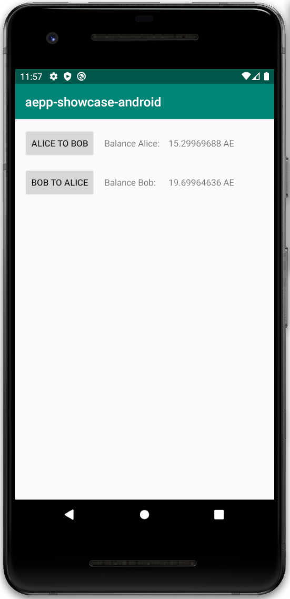

<!-- AUTO-GENERATED-CONTENT:START (STARTER) -->

  

<h1 align="center">
  kryptokrauts.com
</h1>

This is a simple showcase that demonstrates how the [aepp-sdk-java](https://github.com/kryptokrauts/aepp-sdk-java) can be used in an Android application.

  

## Join the discussion
There are some limitations and general information you need to know when developing an Android application using the SDK. You can help us improving the current state and join the discussion here:
- https://forum.aeternity.com/t/android-sdk-for-aeternity/4367

## Support us

If you like this project we would appreciate your support. You can find multiple ways to support us here:

- https://kryptokrauts.com/support
